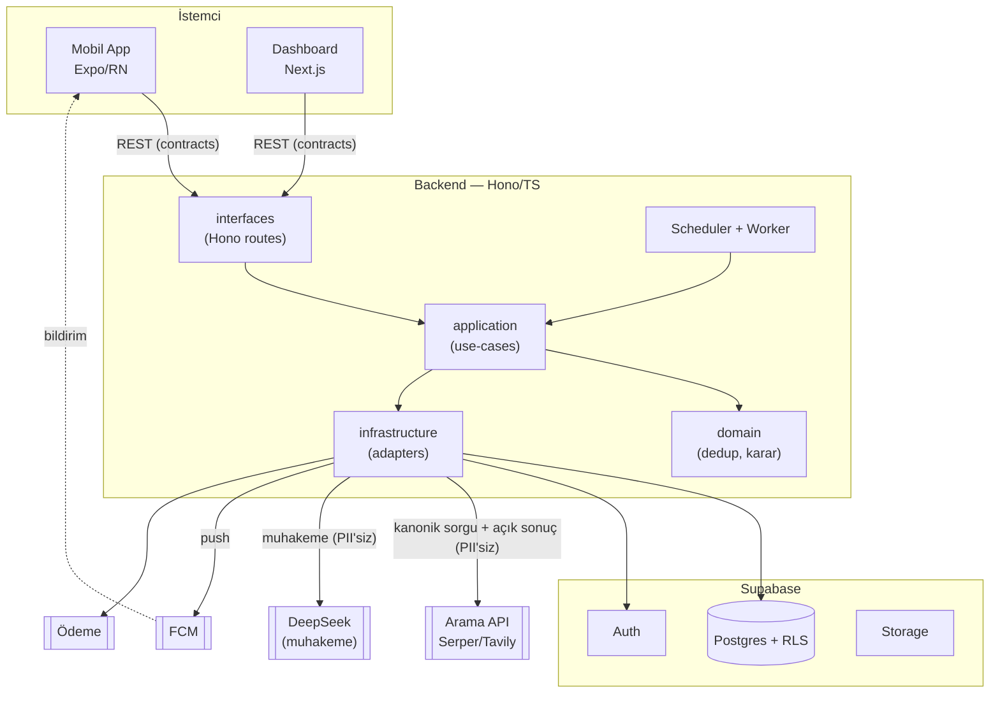
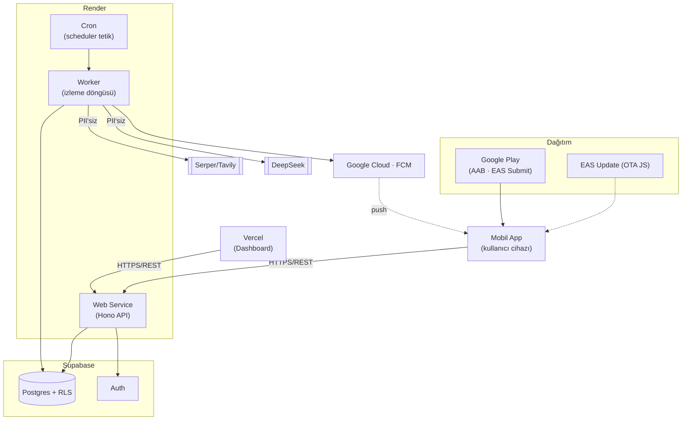
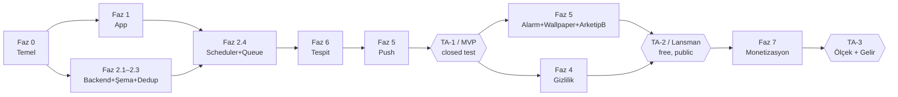
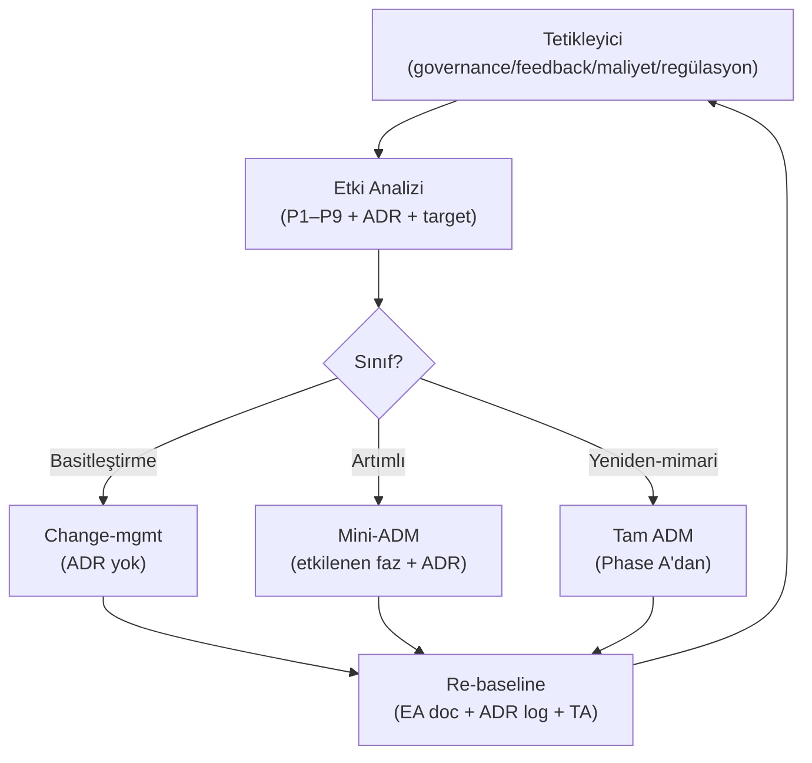

# Watcher — Kurumsal Mimari (TOGAF ADM + ISO)

> **Doküman tipi:** Enterprise Architecture / Architecture Definition (TOGAF 10 ADM tabanlı, ISO/IEC/IEEE 42010 yapısında).
> **Durum:** TOGAF ADM (Preliminary→H) + Requirements Management ✅ — **paket tam.** Canlı doküman; Phase H ile evrilir.
> **İlgili doküman:** `mimari-karar-gunlugu.md` (Architecture Decision Record — ADR-001…009; bu dokümanın governance'ı altında).
> **Standart sürümleri:** TOGAF Standard 10th Edition (2022) · ISO/IEC/IEEE 42010:2022 · ISO/IEC 25010:2023 · ISO/IEC 27001:2022 + 27002:2022.

---

## 0. Doküman Kontrolü (ISO/IEC/IEEE 42010 — Architecture Description kimliği)

- **Sistem-of-interest:** "Watcher" — doğal dille tanımlanan olayları periyodik gerçek-internet aramasıyla izleyen, AI muhakemesiyle olay-tespiti yapan ve FCM push / alarm / duvar-kağıdı ile haber veren native Android uygulaması + backend + dashboard.
- **Mimari kapsam:** Tüm ürün/iş (mobil app, backend, dashboard, destek servisleri, iş modeli).
- **Birincil mimar / karar verici:** Mehmet (çoklu şapka: enterprise architect + developer + product owner + ops).
- **Bu doküman neyi tanımlar:** Mimarinin kendisini değil, **mimari tanımını** (42010 ayrımı): prensipler, gereksinimler, view'lar ve kararlar.
- **Sürüm notu (2026-06-13, ADR-095/096 — Artımlı):** AI muhakeme hattı tek-sağlayıcı sabitten **admin-seçimli model yönlendiricisine** evrildi (Groq/DeepSeek kataloğu; `app_settings` + çağrı-anı yönlendirme; PII-sınırı P1 değişmedi — hatta giden veri aynı). Yönetim yüzeyi mobil sekmeden ayrı **Whenly Console** stack'ine taşındı; işletim görünürlüğü için sağlayıcı-kullanım panosu (gerçek API verisi) eklendi. Tanıtım sitesi **global-first** (EN kök, TR /tr) yapıldı; pazarlama yetenekleri (.claude/skills: product-marketing/copywriting/copy-editing) yeniden kullanılabilir EA varlığı olarak eklendi.

---

## 1. PRELIMINARY PHASE — Çerçeve ve Prensipler

### 1.1 Amaç
Mimari çalışmaya başlamadan önce: kapsamı netleştir, TOGAF'ı bu bağlama **tailor et**, mimari prensipleri tanımla, governance ve repository'yi kur, ISO standartlarının nereye gireceğini sabitle.

### 1.2 Kapsam (Scope)
- **"Enterprise" tanımı:** Solo girişim olduğu için *ürün = enterprise*. Departman/iş-birimi yok; "iş" katmanı = ürünün iş modeli (free tier + abonelik/ömür-boyu, dedup ekonomisi).
- **Dahil:** Mobil app, backend, dashboard, Supabase/Render/FCM/DeepSeek/arama-API entegrasyonları, iş modeli, gizlilik/güvenlik, yayın.
- **Hariç (şimdilik):** Çoklu-ürün portföyü, organizasyon yapısı/İK, departmanlar-arası IT yönetişimi (yok).

### 1.3 Mimari Prensipler
*TOGAF formatı — her prensip: Statement / Rationale / Implications. Bunlar tüm ADM fazlarında karar kriteridir.*

**P1 — PII-Sınırı Mutlaktır**
- *Statement:* Dış muhakeme/arama hattına (DeepSeek + web arama) **asla** kişisel veri girmez; yalnızca kanonik sorgu + herkese açık sonuç gider.
- *Rationale:* KVKK/GDPR yurt-dışı aktarım riski (Çin = adequacy yok), gizlilik-by-design, saldırı yüzeyini küçültür. (Bkz. ADR-002.)
- *Implications:* `packages/contracts`'ta PII-sınırı DTO; her veri akışı diyagramı sınırı işaretler; ihlal = mimari uyumsuzluk (governance reddi).

**P2 — Maliyet Benzersiz-Konuya Bağlıdır**
- *Statement:* Aynı konuyu izleyen N kullanıcı = 1 arama + 1 muhakeme + ücretsiz FCM fan-out (dedup).
- *Rationale:* Free-tier + milyon-kullanıcı ekonomisinin kalbi; maliyet kullanıcı sayısıyla değil benzersiz-konu sayısıyla ölçeklenir.
- *Implications:* Dedup, data modelinin merkezinde; watcher'lar kanonikleştirilir; paylaşımlı-watcher mimarisi (Faz 2.3 / Phase C).

**P3 — Yönetilen Servis > İnşa**
- *Statement:* Çekirdek-olmayan yetenekler yönetilen servisle (Supabase/Render/FCM); yalnızca farklılaştırıcı çekirdek inşa edilir.
- *Rationale:* Solo dev, time-to-market, düşük operasyonel yük.
- *Implications:* Vendor değerlendirme + kaçış kapıları (lock-in azaltma); inşa edilen çekirdek = AI-karar + dedup + delivery orkestrasyonu.

**P4 — Tek Doğruluk Kaynağı: Contracts**
- *Statement:* Tüm sistem sınırları `packages/contracts`'taki Zod şemalarından türer (mobil + dashboard + backend).
- *Rationale:* TS uçtan uca; tip drift'i sıfır; runtime + compile-time güvenlik. (Bkz. ADR-003/009.)
- *Implications:* Şema değişimi tek yerde; OpenAPI buradan üretilir; client tipleri türetilir.

**P5 — Gizlilik ve Güvenlik Tasarımdan**
- *Statement:* KVKK + GDPR + ISO 27002 kontrolleri en baştan; sonradan yamanmaz.
- *Rationale:* Yasal zorunluluk + Play politikaları + kullanıcı güveni.
- *Implications:* Her fazda güvenlik concern'i; veri minimizasyonu; hesap silme; şifreleme (at-rest/in-transit); secret yönetimi.

**P6 — Mobil-Öncelikli, Offline-Dayanıklı**
- *Statement:* Birincil deneyim mobil; kötü ağ koşullarında graceful davranış.
- *Rationale:* Hedef kitle mobil; kaçırılan bildirim için fallback (duvar kağıdı).
- *Implications:* Offline cache (TanStack persist/MMKV); optimistic UI; FCM + alarm + wallpaper teslim katmanları.

**P7 — Tersine-Çevrilebilir Kararlar (Escape Hatches)**
- *Statement:* Her önemli karar bir kaçış kapısıyla gelir; tek-yönlü kapılar minimize edilir.
- *Rationale:* Solo dev belirsizliği; yanlış çıkarsa düşük-maliyetli geri dönüş.
- *Implications:* ADR'lerde "kaçış kapısı" zorunlu; gevşek bağlama; adaptör desenleri.

**P8 — Kalite ISO 25010 ile Ölçülür**
- *Statement:* NFR'ler ISO/IEC 25010:2023 karakteristiklerine bağlanır ve ölçülür.
- *Rationale:* Ortak dil, kapsama disiplini, değerlendirilebilirlik.
- *Implications:* Requirements Spec'te 25010 haritası; her faz ilgili karakteristikleri ele alır; test stratejisine bağlanır (Faz 8).

**P9 — Sağ-Boyutlu Titizlik**
- *Statement:* Standartlar tailor edilerek uygulanır; alakasız ceremony elenir.
- *Rationale:* Profesyonel uygulama = uyarlama; yanlış-ölçek = israf. (25010 modeli pratikte alakasız karakteristikler elenerek daraltılır.)
- *Implications:* ADM fazları sisteme ölçeklenir; 27001 kontrol-evet/sertifika-sonra; 25010 alakasız karakteristikler elenir.

### 1.4 TOGAF Framework Tailoring (bu bağlama uyarlama)
- **ADM kapsamı:** Preliminary → A → B → C → D → E → F → G → H, **Requirements Management merkezde** sürekli. Tüm fazlar işlenir ama **ürün ölçeğine** indirgenir (organizasyon-yönetişimi artifact'ları minimal).
- **Konsolide deliverable seti** (solo için tek/az dosyada):
  1. Architecture Vision (Phase A)
  2. Architecture Definition Document — ADD (Phase B/C/D, 42010 view'larıyla)
  3. Architecture Requirements Specification — ARS (25010 kalite + 27002 güvenlik gereksinimleri)
  4. Architecture Roadmap + Implementation & Migration Plan (Phase E/F = mevcut Faz 0–11)
  5. Architecture Governance (Phase G/H) + ADR log
- **ISO entegrasyon noktaları:** 42010 = her tanımın yapısı (stakeholder→concern→viewpoint→view); 25010 = ARS'nin kalite bölümü; 27001/27002 = ARS'nin güvenlik bölümü + governance (ISMS framing, sertifika ertelenir).
- **İterasyon yaklaşımı:** Greenfield → tek "Baseline yok / Target var" geçişi; Phase F'te artımlı teslim (MVP→ölçek); lansman sonrası Phase H ile döngü.
- **Karar kaydı:** Mevcut ADR-001…009 + yeni ADR'ler = tek Architecture Decision Record (`mimari-karar-gunlugu.md`), bu doküman governance'ı altında.

### 1.5 Architecture Governance (Preliminary kurulum)
- **Uyum kontrolü (compliance):** CI kalite kapıları (Faz 9) + ADR self-review + prensip-conformance checklist (P1–P9 her karar için).
- **Architecture Board:** Solo → "architect şapkası"; ileride danışman/yatırımcı review noktası eklenebilir.
- **Değişim yönetimi:** Phase H'de; bir kararı değiştiren yeni ADR eskisini "supersedes" eder (karar günlüğünde işaretlenir).
- **Repository:** Repo `docs/` → `docs/architecture/` (bu doküman) + `docs/adr/` (karar günlüğü).

### 1.6 Paydaşlar ve Concern'ler (Preliminary — light; Phase A'da derinleşir, 42010)
| Paydaş | Birincil concern'ler |
|---|---|
| Founder/dev (Mehmet) | Sevk hızı, sürdürülebilirlik, maliyet, mimari olgunluk |
| Son kullanıcılar | Bildirim güvenilirliği, gizlilik, free-tier değeri, pil/performans |
| Google Play | Politika uyumu (izinler, data safety, hesap silme) — gatekeeper |
| Regülatörler (KVKK/GDPR) | Yasal uyum, veri minimizasyonu, yurt-dışı aktarım |
| Servis sağlayıcılar (Supabase/Render/DeepSeek/arama-API) | SLA, maliyet, kota, lock-in |
| Gelecek yatırımcılar | Ölçeklenebilirlik, birim ekonomisi, mimari olgunluk |

### 1.7 Preliminary — Doğrulama
- **Çıktı:** Kapsam + P1–P9 prensipleri + tailoring + governance + repository + paydaş taslağı sabitlendi.
- **Sonraki:** Phase A — Architecture Vision (Statement of Architecture Work, paydaş/concern derinleştirme, target vizyon, değer, risk).

---

## 2. PHASE A — Architecture Vision

### 2.1 Statement of Architecture Work (SoAW)
- **Başlık:** Watcher Ürün Mimarisi — Greenfield (Baseline yok → Target).
- **Tanım/kapsam:** Tüm ürün (mobil app + backend + dashboard + destek servisleri + iş modeli).
- **Mimari hedefler (iş hedefiyle hizalı):**
  1. Güvenilir olay-tespiti ve teslim — *kaçırılmayan* bildirim (çok-katmanlı: FCM + alarm + wallpaper).
  2. Free-tier'da sürdürülebilir birim ekonomisi (dedup ile maliyet benzersiz-konuyla ölçeklenir).
  3. KVKK/GDPR/Play uyumlu, gizlilik-by-design (PII dış hatta asla).
  4. Milyon-kullanıcıya ölçeklenebilir + solo-dev tarafından sürdürülebilir.
- **Kapsam dışı:** Çoklu-ürün portföyü, organizasyon/İK, departman-yönetişimi. **iOS şimdilik kapsam dışı** (native teslim katmanı — özellikle wallpaper — Android'e bağlı; varsayım, ileride gözden geçirilir).
- **Kısıtlar:** Solo dev (telefon + Oracle VM, PC yok) · baz sabit maliyet ~$52/ay · arama-API maliyeti dominant · DeepSeek web'e bağlanamaz (yalnızca muhakeme) · Çin adequacy yok → PII-sınırı zorunlu · Android-öncelik.
- **Varsayımlar:** Paylaşımlı-watcher dedup uygulanabilir · Serper(+Tavily) arama için yeterli · Supabase/Render/Vercel/FCM hedef ölçeği taşır.
- **Teslimatlar:** Bu EA dokümanı (Vision · ADD · ARS · Roadmap · Governance) + ADR log.
- **Roller:** Mehmet — architect + developer + product owner + ops.

### 2.2 Architecture Vision (Target — üst seviye)
- **Vizyon:** *"Herkesin, kod yazmadan, doğal dille 'şu olunca haber ver' diyebildiği ve gerçekten zamanında haber alabildiği; gizliliği tasarımdan korunan, milyon-kullanıcıya ölçeklenen bir olay-izleme asistanı."*
- **Üst-seviye akış:** kullanıcı → app (doğal-dil watcher tanımı) → backend (kanonikleştir + **dedup**) → periyodik döngü (gerçek arama + DeepSeek muhakeme) → *olay oldu mu?* → evetse teslim (FCM push → opsiyonel alarm → opsiyonel wallpaper fallback). İş katmanı: free-tier → sıklık/limit üstü abonelik/ömür-boyu.
- **Değer önermesi:**
  - *Kullanıcı:* el-emeği takip yok · kaçırma yok (çok-katmanlı teslim) · gizlilik (PII hattı dışı) · *herhangi* bir konu (koda gömülü değil) · teknik bilgi gerektirmez.
  - *İş:* maliyet benzersiz-konuyla ölçeklenir → free-tier ekonomik kalır; gelir = sıklık/limit üstü abonelik.

### 2.3 Paydaş–Concern–Viewpoint Matrisi (ISO/IEC/IEEE 42010)
| Paydaş | Concern'ler | Adresleyen view (faz) |
|---|---|---|
| Son kullanıcı | Güvenilirlik, gizlilik, free-tier değeri, pil/performans | Application+Technology (teslim, D) · Data (PII, C) · Business (free-tier, B) |
| Founder/dev | Sevk hızı, sürdürülebilirlik, maliyet, olgunluk | Tüm view'lar + Roadmap (F) |
| Google Play | İzinler, data-safety, hesap silme | Data (PII, C) · Technology (izinler, D) · Governance (G) |
| Regülatör (KVKK/GDPR) | Uyum, veri minimizasyonu, yurt-dışı aktarım | Data (PII sınırı, C) · ARS güvenlik (Req-Mgmt) |
| Servis sağlayıcı | SLA, kota, maliyet, lock-in | Technology (D) · Opportunities/build-vs-buy (E) |
| Gelecek yatırımcı | Ölçek, birim ekonomisi, olgunluk | Business (dedup, B) · Roadmap (F) |

### 2.4 İş Senaryosu (problem → çözüm → değer)
- **Problem:** İnsanlar belirli olayları (başvuru açılışı, sonuç ilanı, stok/fiyat, haber, vb.) elle ve tekrar tekrar kontrol ediyor — ve kaçırıyor. Mevcut çözümler ya konu-spesifik, ya teknik (RSS/scraper/IFTTT), ya da güvenilmez.
- **Çözüm:** Doğal-dil tanım + gerçek arama + AI muhakeme + güvenilir çok-katmanlı teslim.
- **Değer:** Zaman tasarrufu + kaçırmama + erişilebilirlik (teknik bilgi gerektirmez) + gizlilik.

### 2.5 Yetenek Değerlendirmesi (Capability — light)
- **Mevcut:** Güçlü solo dev (TS/Python/mobil/AI) · yönetilen-servis stack'i · $300 GCP kredisi (FCM).
- **Gerekli (inşa):** dedup + AI-karar + delivery orkestrasyonu (farklılaştırıcı çekirdek).
- **Gerekli (kur):** observability + CI/CD + ödeme/abonelik altyapısı.
- **Gap → kapanış:** ödeme (Faz 7) · native özellikler (Faz 5) · gizlilik-yasal (Faz 4) · gözlemlenebilirlik (Faz 10). Roadmap'te ele alınır.

### 2.6 İlk Risk Değerlendirmesi (TOGAF — initial; residual Faz E/F'te düşürülür)
| # | Risk | Etki | Azaltım | Faz |
|---|---|---|---|---|
| R1 | Arama-API maliyet/kota patlaması | Yüksek | Dedup (P2) + sıklık limitleri + ölçekte DataForSEO async; Tavily fallback | 2.x/6 |
| R2 | DeepSeek/arama PII sızıntısı | Yüksek (yasal) | P1 PII-sınırı DTO + tasarım gereği PII-siz hat | 4/6 |
| R3 | Android native politika değişimi (wallpaper/exact-alarm) | Orta | Doğru izinler; arka-plan wallpaper SET izinli; Play politika takibi | 5 |
| R4 | Play reddi (izin/data-safety/silme) | Yüksek | Data-safety formu + hesap silme URL + izin gerekçeleri | 4/11 |
| R5 | Vendor lock-in / fiyat değişimi | Orta | Kaçış kapıları (P3/P7) + contracts soyutlaması | E |
| R6 | Free-tier suistimali (kötü-niyetli çok watcher) | Orta | Rate-limit + abuse kontrol | 2.5/3 |
| R7 | AI yanlış-pozitif/negatif (olay kaçırma/yanlış haber) | Yüksek | Muhakeme prompt disiplini + eşik + kullanıcı geri-bildirim; ileride doğrulama | 6 |
| R8 | Solo-dev bandwidth / tek-nokta | Orta | Lean kapsam + yönetilen servis + CI otomasyonu | tümü |
| R9 | Yasal (yurt-dışı aktarım, VERBİS) | Yüksek | P5 + Faz 4; tüzel kişilik kurulunca VERBİS | 4 |

### 2.7 Mimari Kabul Kriterleri / KPI'lar
- **Teslim güvenilirliği:** kaçırılan-olay oranı düşük (hedef ARS'de sayısallaşır).
- **Birim ekonomisi:** benzersiz-konu başına maliyet < eşik; free-tier kullanıcı başına *marjinal* maliyet ≈ 0 (dedup).
- **PII-sınırı:** dış hatta **0 PII** (denetlenebilir).
- **Play uyumu:** yayın engeli yok.
- **ISO 25010:** hedef karakteristikler karşılanır (Requirements Management'ta ölçülür).

### 2.8 Phase A — Doğrulama
- **Çıktı:** SoAW + Target vizyon + paydaş/concern matrisi + iş senaryosu + yetenek + 9 risk + kabul kriterleri sabitlendi. Prensip-conformance: P1–P9 ile tutarlı.
- **Sonraki:** Phase B — Business Architecture (iş modeli, capability map, value stream, aktör/rol, dedup ekonomisi).

## 3. PHASE B — Business Architecture

### 3.1 İş Modeli
- **Müşteri segmentleri:** *Free* (kazara/az watcher, düşük sıklık) · *Ödeyen* (power user / yüksek sıklık / çok watcher / zaman-kritik kullanım).
- **Gelir modeli:** Free tier (≤N watcher, minimum kontrol sıklığı) → **abonelik** (daha yüksek sıklık + daha çok watcher + öncelik) + **ömür-boyu satın alma** opsiyonu.
- **Maliyet yapısı:** Baskın = arama-API (dedup ile azaltılır) · sabit baz ~$52/ay (Supabase Pro $25 + Render $7 + Vercel Pro $20) · DeepSeek (ucuz, cache) · FCM (ücretsiz).
- **Temel içgörü (P2):** Dedup, free-tier'ı uygulanabilir kılar — aynı konuda N kullanıcı = 1 arama + 1 muhakeme + ücretsiz fan-out.
- **Kanallar:** Google Play (dağıtım) · web dashboard (Vercel).
- **Temel kaynaklar:** Yönetilen servisler + farklılaştırıcı çekirdek (dedup / AI-karar / delivery).
- **Temel ortaklar:** Supabase · Render · Vercel · Google (FCM/Play) · DeepSeek · Serper/Tavily · ödeme sağlayıcı.

### 3.2 İş Kapasite Haritası (Business Capability Map — *ne* yapabilmeli)
| Kapasite (L0) | Alt-kapasiteler (L1) |
|---|---|
| **Kullanıcı Yönetimi** | Kayıt/kimlik · kimlik doğrulama · hesap yaşam-döngüsü (silme dahil) · tercih yönetimi |
| **Watcher Yönetimi** | Doğal-dil yakalama · **kanonikleştirme** · yaşam-döngüsü (oluştur/düzenle/duraklat/sil) · sıklık yapılandırma |
| **Olay İzleme** | Zamanlama (scheduling) · gerçek-arama yürütme · **dedup/paylaşım** · sonuç toplama |
| **Olay Tespiti** | AI muhakeme (DeepSeek) · olay-karar (eşik) · yanlış-poz/neg yönetimi · geri-bildirim döngüsü |
| **Teslim** | Push (FCM) · alarm · wallpaper-fallback · teslim-tercihi · teslim-onay/izleme |
| **Para Kazanma** | Plan/abonelik · ödeme/faturalama · limit/kota uygulama (free vs paid) · dönüşüm |
| **Gizlilik & Uyum** | PII-sınırı uygulama · rıza/izin · veri-saklama · hesap-silme · yasal raporlama (KVKK/GDPR) |
| **Platform & Operasyon** | Observability · hata yönetimi · rate-limit/abuse · CI-CD/dağıtım · maliyet-yönetimi |

### 3.3 Value Stream'ler (uçtan-uca değer akışı)
**VS1 — Birincil: "Kullanıcıyı bir olaydan haberdar et"**
1. Watcher tanımla (doğal-dil → kanonik watcher)
2. İzlemeye al (dedup → paylaşımlı/benzersiz konu)
3. Periyodik kontrol (zamanlama → gerçek arama)
4. Olayı değerlendir (AI muhakeme → karar)
5. Haber ver (teslim: push → alarm → wallpaper)
6. Geri-bildirim (doğruluk iyileştirme)

**VS2 — İkincil: "Free kullanıcıyı ödeyene dönüştür"**
free kullanım → limit/değer farkına varma → upgrade tetiği (limit aşımı / sıklık ihtiyacı) → abonelik/satın alma → ödeyen kullanım.

**VS3 — Destek: "Onboard et ve güvende tut"**
kayıt → izin/rıza → tercih ayarı → gizlilik garantisi (PII-sınırı şeffaflığı).

### 3.4 Kapasite ↔ Value Stream Çapraz-Haritası (VS1)
| VS1 aşaması | Etkinleştiren kapasite(ler) |
|---|---|
| 1 Tanımla | Watcher Yönetimi · Kullanıcı Yönetimi |
| 2 İzlemeye al | Olay İzleme (dedup) · Watcher Yönetimi |
| 3 Kontrol | Olay İzleme (scheduling, arama) · Platform & Ops |
| 4 Değerlendir | Olay Tespiti · Gizlilik & Uyum (PII-sınırı) |
| 5 Haber ver | Teslim · Para Kazanma (limit) · Platform & Ops |
| 6 Geri-bildirim | Olay Tespiti |

### 3.5 Aktörler / Roller
- **İnsan:** Founder/operator (Mehmet — tüm operasyonel roller) · son kullanıcı (free/paid).
- **Sistem aktörleri:** scheduler · monitoring worker · detection engine · delivery dispatcher.
- **Dış servis aktörleri:** arama-API · DeepSeek · FCM · ödeme sağlayıcı · Supabase/Render.

### 3.6 İş Servisleri (müşteriye dönük)
Watcher servisi · İzleme & tespit servisi · Bildirim/teslim servisi · Hesap & gizlilik servisi · Abonelik & faturalama servisi.

### 3.7 Temel İş Süreçleri
Watcher kanonikleştirme + dedup eşleştirme · izleme döngüsü (scheduled) · tespit + karar · teslim + onay · faturalama + limit uygulama · hesap silme + veri temizleme.

### 3.8 Dedup Ekonomisi — İş-Katmanı Modeli (P2, ekonominin kalbi)
- **Birim:** "benzersiz izlenen konu" (canonical watch topic).
- **Maliyet sürücüsü:** benzersiz-konu sayısı × kontrol sıklığı × (arama + muhakeme maliyeti) — **kullanıcı sayısı değil.**
- **Free-tier ekonomisi:** popüler konular çok kullanıcıyla paylaşılır → kullanıcı başına *marjinal* maliyet ≈ 0. Niş/benzersiz konular maliyetlidir → free-tier'da düşük sıklık + limit ile sınırlanır.
- **Gelir mantığı:** sıklık (daha sık = daha çok maliyet = ödeme) + watcher-sayısı limiti + öncelik. Ömür-boyu = öngörülebilir gelir ama maliyet süreklidir → fiyatlama benzersiz-konu maliyetini karşılamalı (sayısallaşması Phase E business-case).
- **Risk bağlantısı:** R1 (maliyet) + R6 (suistimal) bu modelin sınırını test eder → rate-limit + kota (Platform&Ops + Monetization kapasiteleri).

### 3.9 Phase B — Doğrulama
- **Çıktı:** İş modeli + 8 L0 kapasite + 3 value stream + kapasite/VS çapraz-harita + aktör/rol + iş servisleri + dedup ekonomisi modeli sabitlendi. P2/P3/P5 ile tutarlı.
- **Sonraki:** Phase C — Information Systems Architecture (Data: Supabase şema + PII sınırı + dedup veri modeli + RLS · Application: mobil/dashboard/backend bileşenleri). Kapasiteler burada uygulama/veri bileşenlerine eşlenir.

## 4. PHASE C — Information Systems Architecture

### 4.1 Data Architecture

#### 4.1.1 Mantıksal Veri Entity'leri
| Entity | Açıklama | Zon | Anahtar alanlar |
|---|---|---|---|
| **User** (profile) | Kullanıcı kimliği/profili (Supabase `auth.users` + `profiles`) | **PII** | id, email, locale, created_at |
| **Watch** | Kullanıcının watcher örneği | **PII** (ham ifade kişisel olabilir) | id, user_id, raw_intent, canonical_topic_id(FK), frequency, delivery_prefs, **archetype(A/B)**, personal_criteria_ref, status |
| **CanonicalTopic** | Dedup'lanmış, PII'siz "ne izleniyor" | **Paylaşılan / PII'siz** | id, canonical_query, search_params, check_state, last_checked_at |
| **CheckRun** | Bir topic için arama+muhakeme yürütmesi | **Paylaşılan / PII'siz** | id, topic_id(FK), ran_at, result_summary, reasoning, decision, confidence |
| **DetectionEvent** | Topic için olay tespit edildi | **Paylaşılan / PII'siz** | id, topic_id(FK), check_run_id(FK), description, detected_at |
| **Delivery** | Kullanıcı başına fan-out bildirim | **PII** (user bağlantısı) | id, event_id(FK), user_id, watch_id, channel, status, sent_at |
| **PersonalCriteria** | Arketip-B kişisel değerlendirme verisi | **PII (hassas) — cihaz/secure-store öncelikli** | id, user_id, watch_id, criteria_data |
| **Subscription** | Plan/abonelik | **PII-bitişik** | id, user_id, plan, status, limits, payment_ref |
| **DeviceToken** | FCM cihaz token'ı | **PII-bitişik** | id, user_id, fcm_token, platform |
| **UserFeedback** | Tespit doğruluğu geri-bildirimi | **PII** | id, user_id, event_id, verdict, created_at |

#### 4.1.2 Dedup Veri Modeli + İki Watcher Arketipi *(→ ADR-010)*
- **Dedup mekanizması:** Çok sayıda `Watch` → tek `CanonicalTopic` (N:1 FK). Kontrol topic başına **bir kez** yürür (`CheckRun`); olay olursa (`DetectionEvent`) o topic'e bağlı tüm `Watch`'lara fan-out (`Delivery`). → maliyet benzersiz-konuyla ölçeklenir (P2).
- **Arketip A — Paylaşılabilir:** olay herkes için aynı ("YKS başvuruları açıldı", "iPhone 17 çıktı", "BTC > X"). Tam dedup, PII'siz, paylaşılan tespit + fan-out.
- **Arketip B — Kişisel-değerlendirilen:** herkese açık veri paylaşılır ama "*bana* oldu mu?" kişisel veri ister ("piyango çekilişi yayınlandı" paylaşılan; "ben kazandım mı" kişisel). **Çözüm:** paylaşılan boru hattı yalnızca *herkese açık verinin/olayın mevcudiyetini* tespit eder (PII'siz, dedup'lanabilir); final "bana uyuyor mu?" değerlendirmesi **kullanıcı-kapsamlı/cihaz-üstü** yapılır — kişisel veri asla dış hatta (arama/DeepSeek) gitmez. PersonalCriteria cihazda (secure-store) öncelikli.

#### 4.1.3 PII Sınıflandırma & Zon (P1 uygulaması)
- **PII / user-scoped zon:** User, Watch, Delivery, PersonalCriteria, Subscription, DeviceToken, UserFeedback. → RLS ile korunur.
- **PII'siz / paylaşılan zon:** CanonicalTopic, CheckRun, DetectionEvent. **Hiç kullanıcı tanımlayıcısı / kişisel veri yok.** Dış hatta (arama/DeepSeek) yalnızca `canonical_query` + herkese açık sonuç gider.
- **Köprü:** `Watch.canonical_topic_id` özel watch'ı paylaşılan PII'siz topic'e bağlar; kanonikleştirme süreci ham ifadeden PII'yi **sıyırır**.

#### 4.1.4 RLS Stratejisi (Supabase)
- **PII zon tabloları:** RLS ON; politika = `user_id = auth.uid()` (kullanıcı yalnızca kendi satırını görür).
- **Paylaşılan zon tabloları:** kullanıcı-kapsamlı değil → yalnızca **backend service-role** erişir; client doğrudan sorgulamaz. Client, olay bilgisini kendi `Delivery` satırı üzerinden alır (backend server-side join ile PII'siz olay açıklamasını kullanıcının teslimine ölçekler).
- **Roller:** backend pipeline = service-role (RLS bypass); client = auth-role (RLS zorunlu).

#### 4.1.5 Veri-entity ↔ Kapasite Haritası
Watcher Yönetimi → Watch, CanonicalTopic · Olay İzleme → CanonicalTopic, CheckRun · Olay Tespiti → CheckRun, DetectionEvent, UserFeedback · Teslim → Delivery, DeviceToken · Kullanıcı Yönetimi → User · Para Kazanma → Subscription · Gizlilik & Uyum → (cross-cutting: tüm PII zon + PersonalCriteria).

### 4.2 Application Architecture

#### 4.2.1 Uygulama Bileşenleri
- **Mobil App (Expo/RN)** — feature-sliced (ADR-004): `features/{auth, watchers, delivery, billing, settings}` + presentation/domain/data + Expo Router (ADR-006) + state (ADR-005). **Arketip-B yerel değerlendirme burada.**
- **Backend (Hono/TS)** — DDD katmanları (ADR-009): domain/application/infrastructure/interfaces. **Farklılaştırıcı çekirdek** (dedup, AI-karar, delivery orkestrasyonu, limit uygulama, PII-sınırı).
- ~~Dashboard (Next.js/Vercel)~~ — **kaldırıldı (ADR-032):** admin dahil her şey mobil uygulamada; mobil-web tarayıcı erişimini karşılar. *(Not: §4.2.2-4.2.4, teknoloji/maliyet tabloları ve TA-3 yol haritasındaki Dashboard geçişleri ADR-032 ÖNCESİ tarihsel modeldir — temizlik borcu olarak kayıtlı; yeni görünüm üretirken Dashboard'u dahil ETME.)*
- **Tanıtım Sitesi (`apps/website` — statik SSG/Vercel, ADR-090)** — pazarlama + **GEO dağıtım katmanı**: AI asistanlarının ürünü tanıması/önermesi için statik HTML (AI crawler'lar JS çalıştırmaz), TR+EN use-case sayfaları, robots/sitemap/llms.txt/JSON-LD; backend'e bağımlılığı YOK (sıfır PII, sıfır API çağrısı). Kanonik strateji: `docs/GEO-pazarlama-mimarisi.md`.
- **Paylaşılan: `packages/contracts`** — Zod şemaları (P4), API yüzeyi sözleşmesi → uçtan uca tip.

#### 4.2.2 Uygulama ↔ Kapasite Haritası
| Kapasite | Realize eden bileşen(ler) |
|---|---|
| Kullanıcı Yönetimi | Mobil (auth UI) · Dashboard · Backend (auth/infra) · Supabase Auth |
| Watcher Yönetimi | Mobil (watchers feature) · Dashboard · Backend (CreateWatcher + kanonikleştirme) |
| Olay İzleme | Backend (Scheduler + Worker + dedup) |
| Olay Tespiti | Backend (DeepSeek reasoning + karar) |
| Teslim | Backend (FCM dispatch) · Mobil (alma/gösterme + arketip-B yerel değerlendirme) |
| Para Kazanma | Mobil/Dashboard (billing UI) · Backend (limit uygulama + faturalama) |
| Gizlilik & Uyum | Backend (PII-sınırı uygulama) · Mobil (rıza/izin UI, secure-store) |
| Platform & Operasyon | Backend (observability/rate-limit) · CI/CD |

#### 4.2.3 Uygulama Etkileşimi
- **Senkron:** Mobil/Dashboard → Backend API (Hono REST + OpenAPI, contracts'tan). Kullanıcı eylemleri (watcher CRUD, auth, billing).
- **Asenkron:** Backend Scheduler → canonical-topic kontrollerini kuyruğa alır → Worker yürütür (arama → DeepSeek → karar) → olayda DetectionEvent → fan-out Delivery → FCM. (Kuyruk/scheduler detayı = Faz 2.4 / Phase D-E.)
- **Dış entegrasyon:** Backend ↔ arama-API, DeepSeek, FCM, ödeme, Supabase.
- **PII sınırı (etkileşimde):** dış hatta yalnızca `canonical_query` + herkese açık sonuç; arketip-B kişisel değerlendirme mobilde (cihaz) / user-scoped backend bağlamında.

#### 4.2.4 C4 — Container Görünümü

#### 4.2.5 Backend Component Görünümü (C4 — Component)
- **interfaces:** Hono route'ları + DTO (contracts/Zod) + auth middleware.
- **application (use-case'ler):** `CreateWatcher` (+ kanonikleştirme) · `RunTopicCheck` · `DecideEvent` · `FanOutDelivery` · `EnforceLimit` · `RecordFeedback`.
- **domain:** `Watch`, `CanonicalTopic`, `DetectionEvent`, dedup mantığı, arketip kuralı, olay-eşik politikası.
- **infrastructure (adapter'lar):** `SupabaseRepo` · `SearchClient` (Serper/Tavily) · `DeepSeekClient` · `FcmClient` · `PaymentClient` · `Queue`.

### 4.3 Phase C — Doğrulama
- **Çıktı:** 10 mantıksal entity + dedup veri modeli + iki arketip + PII zon/RLS stratejisi + uygulama bileşenleri + kapasite/uygulama haritası + C4 container & component görünümü. P1/P2/P4 ile tutarlı.
- **Yeni karar:** İki watcher arketipi + kişisel-değerlendirme-yerelde → **ADR-010** (karar günlüğüne eklendi).
- **Sonraki:** Phase D — Technology Architecture (stack, deployment topolojisi, ortamlar, ağ/güvenlik teknolojileri).

## 5. PHASE D — Technology Architecture

### 5.1 Teknoloji Stack Haritası (bileşen → teknoloji)
| Bileşen | Teknoloji |
|---|---|
| **Mobil App** | Expo (CNG + Dev Build) / React Native / TS · Expo Router · NativeWind · TanStack Query + Zustand · expo-secure-store · config plugins + Expo Modules (Kotlin) → native (wallpaper/alarm/FCM) |
| **Backend API** | Hono + TS (Node, Render) · Zod (@hono/zod-openapi) |
| **Backend Worker/Scheduler** | Node (Render Worker + Cron) · kuyruk: **Faz 2.4 açık** (BullMQ/Redis vs pg-boss/Postgres) |
| **Dashboard** | Next.js / TS (Vercel) |
| **DB / Auth / Storage** | Supabase (Postgres + RLS · Auth · Storage) |
| **Push** | Firebase Cloud Messaging (data-only, high-priority) |
| **AI muhakeme** | DeepSeek `deepseek-v4-flash` · JSON-mode · PII'siz |
| **Web arama** | Serper.dev (primary) + Tavily (fallback) · ölçekte DataForSEO async |
| **Ödeme** | **Faz 7 açık** (Play Billing / Stripe / RevenueCat) |
| **Paylaşılan tip** | `packages/contracts` (Zod) |
| **Monorepo/build** | pnpm workspaces + Turborepo (ADR-003) · EAS Build/Submit/Update |
| **Toolchain** | Biome + strict TS + Lefthook (ADR-007) |

### 5.2 Deployment / Altyapı Topolojisi

### 5.3 Ortamlar (ADR-009)
- **dev:** local backend + Supabase dev/branch · Expo dev build.
- **staging:** Render staging service + Supabase staging · EAS internal/preview.
- **prod:** Render prod + Supabase Pro · EAS production + Play.
- **Secret yönetimi:** Render env groups + EAS secrets · boot'ta Zod env doğrulama → fail-fast.

### 5.4 Teknoloji Standartları / Portföy
- **Dil:** TypeScript (strict) uçtan uca (P4).
- **Runtime:** Node (backend) · RN/Hermes (mobil).
- **Protokol:** HTTPS/REST (OpenAPI, contracts'tan) · FCM push.
- **Veri:** Postgres (Supabase) · authz = RLS.
- **Auth:** Supabase Auth (JWT) · token → expo-secure-store / Android Keystore.
- **Sürümleme:** tek React/RN sürümü (ADR-001 mitigasyonu) · conventional commits (ADR-003).

### 5.5 Ağ & Güvenlik Teknolojileri (cross-ref Faz 3, P1/P5)
- **Taşıma:** her yerde TLS (HTTPS).
- **Secret:** env-tabanlı (Render/EAS) · kodda sır yok (P5) · CI'da secret-scan (Faz 3/9, gitleaks açık).
- **AuthN/Z:** Supabase JWT · RLS (veri katmanı) · backend service-role izolasyonu.
- **API koruması:** CORS (dashboard origin) · rate-limiting (Faz 2.5) · input validation (Zod).
- **PII sınırı (P1):** infra/adapter katmanında uygulanır — dışarı yalnızca `canonical_query` + herkese açık sonuç.

### 5.6 Dış Servis Bağımlılıkları (12-Factor attached resources)
| Servis | Rol | Limit/maliyet | Fallback / kaçış kapısı |
|---|---|---|---|
| Supabase | DB/Auth/Storage | Pro $25/ay (free 7g inaktivitede durur) | self-host Postgres (P3/P7) |
| Render | Backend hosting | Starter $7/ay | başka Node host (Fly/Railway) |
| Vercel | Dashboard | Pro $20/ay (Hobby ticari yasak) | başka SSR/static host |
| FCM | Push | ücretsiz | (Android push tek yol; APNs iOS-dışı) |
| DeepSeek | Muhakeme | ~$0.14/$0.28 per M (cache ucuz) | provider-agnostic adapter → başka LLM |
| Serper/Tavily | Web arama | Serper 2500 free credit · Tavily 1000/ay | DataForSEO async (ölçek) |
| Ödeme | Faturalama | Faz 7 | sağlayıcı seçimi açık |

### 5.7 Phase D — Doğrulama
- **Çıktı:** stack haritası + deployment topolojisi (diyagram) + 3 ortam + teknoloji standartları + ağ/güvenlik teknolojileri + dış servis bağımlılık matrisi (fallback'lerle). ADR-001/003/009 + araştırma raporu ile tutarlı; P1/P3/P5/P7 uygulanıyor.
- **Açık (sonraki fazlar):** kuyruk teknolojisi (Faz 2.4) · ödeme sağlayıcı (Faz 7) · secret-scan aracı (Faz 3/9).
- **Sonraki:** Phase E — Opportunities & Solutions (gerçekleştirme stratejisi, build-vs-buy, çözüm bina blokları, work package'lar, gap→çözüm).

## 6. PHASE E — Opportunities & Solutions

### 6.1 Konsolide Gap Analizi (target vs greenfield baseline)
| Domain | Boşluk | Disposisyon |
|---|---|---|
| Business | Monetizasyon (faturalama/limit) + dönüşüm akışı | İnşa + entegre |
| Data | Şema + dedup modeli + RLS | İnşa (Supabase config + şema) |
| Application | Mobil app · backend (API+Worker) · dashboard · contracts | İnşa |
| Technology | Supabase/Render/Vercel/FCM/DeepSeek/arama hesapları + ortamlar + CI/CD | Edin + yapılandır |
| Cross-cutting | Gizlilik/yasal uyum · observability · güvenlik kontrolleri | İnşa + yapılandır |

### 6.2 Build vs Buy (P3 uygulaması)
| Yetenek/bileşen | Karar | Gerekçe |
|---|---|---|
| DB/Auth/Storage · backend host · dashboard host · push · LLM · web arama · ödeme | **BUY** (Supabase/Render/Vercel/FCM/DeepSeek/Serper-Tavily/Faz7) | commodity, P3 |
| **Dedup + kanonikleştirme** | **BUILD** | farklılaştırıcı çekirdek, P2 |
| **AI-karar / tespit mantığı** | **BUILD** | farklılaştırıcı çekirdek |
| **Delivery orkestrasyonu** (push/alarm/wallpaper + arketip-B yerel) | **BUILD** | farklılaştırıcı + native |
| **PII-sınırı uygulaması** | **BUILD** | P1, çekirdek tasarım |
| **Limit/kota uygulama** | **BUILD** | iş modeli |
| contracts/tip · native modüller (wallpaper/alarm/FCM) | **BUILD** | P4 · ADR-001 |

→ İlke: commodity altyapı/API satın al; **farklılaştırıcı çekirdeği + tutkalı inşa et.**

### 6.3 Solution Building Block'lar (SBB) — kapasite/bileşen/tech eşlemesi
| SBB | Realize ettiği kapasite | Bileşen/tech |
|---|---|---|
| **SBB-1 Kimlik & Hesap** | Kullanıcı Yönetimi | Supabase Auth + profile + silme akışı |
| **SBB-2 Watcher & Kanonikleştirme** | Watcher Yönetimi | Mobil watchers + backend `CreateWatcher` + PII-strip + dedup eşleştirme |
| **SBB-3 İzleme Motoru** | Olay İzleme | Scheduler + Worker + kuyruk + `SearchClient` |
| **SBB-4 Tespit Motoru** | Olay Tespiti | `DeepSeekClient` + karar mantığı + geri-bildirim |
| **SBB-5 Teslim** | Teslim | `FcmClient` + alarm + wallpaper (Expo Modules) + arketip-B yerel + teslim-izleme |
| **SBB-6 Monetizasyon** | Para Kazanma | limit/kota uygulama + faturalama entegrasyonu + dönüşüm |
| **SBB-7 Gizlilik & Uyum** | Gizlilik & Uyum | PII-sınırı uygulama + rıza + veri-saklama + silme |
| **SBB-8 Platform/Ops** | Platform & Operasyon | observability + rate-limit/abuse + CI/CD + env/secret |
| **SBB-9 Contracts** | (temel/cross-cutting) | `packages/contracts` (Zod) |
| **SBB-10 Dashboard** | (web alt-küme) | Next.js yönetim arayüzü |

### 6.4 Work Package'lar → Yol Haritası Eşlemesi
| Work Package | SBB | Faz |
|---|---|---|
| Temel (monorepo/contracts/toolchain/env) | SBB-9 + infra | Faz 0 / 2.1 |
| Auth & Hesap | SBB-1 | Faz 1 / 3 |
| Watcher & Kanonikleştirme | SBB-2 | Faz 1 / 2.2 / 2.3 |
| İzleme | SBB-3 | Faz 2.4 |
| Tespit | SBB-4 | Faz 6 |
| Teslim | SBB-5 | Faz 5 |
| Monetizasyon | SBB-6 | Faz 7 |
| Gizlilik | SBB-7 | Faz 3 / 4 |
| Platform/Ops | SBB-8 | Faz 9 / 10 |
| Dashboard | SBB-10 | paralel/sonra |

### 6.5 Artımlar & Geçiş Mimarileri (Increment → Phase F'in temeli)
- **Increment 1 — MVP (walking skeleton):** auth + watcher oluştur (yalnız **arketip A**) + kanonikleştirme + dedup + izleme döngüsü + tespit + FCM push. Yalnız free tier. **PII-sınırı uygulanır.** → çekirdek değeri + dedup ekonomisini kanıtlar.
- **Increment 2 — Güvenilirlik & native teslim:** alarm + wallpaper fallback · **arketip B** (kişisel değerlendirme yerel) · geri-bildirim döngüsü · rate-limit/abuse · observability.
- **Increment 3 — Monetizasyon & ölçek:** faturalama + limit + dönüşüm · dashboard · ölçek sertleştirme (DataForSEO async) · uyum cilası (data-safety, saklama).

### 6.6 Uygulama Faktörleri / Bağımlılıklar
Temel (contracts/env/infra) → her şeyden önce · Auth → watcher'dan önce · Watcher+kanonikleştirme → izlemeden önce · İzleme → tespit → teslim (boru hattı sırası) · native modüller (teslim) ADR-001 dev-build'e bağlı · monetizasyon çekirdek-değer kanıtından sonra · **gizlilik/güvenlik baştan sona dokunur (en sona bırakılmaz).**

### 6.7 Phase E — Doğrulama
- **Çıktı:** konsolide gap + build-vs-buy + 10 SBB (kapasite/bileşen/tech eşlemeli) + work package→faz haritası + 3 artım (MVP→ölçek) + bağımlılık sırası. P1/P2/P3 ile tutarlı.
- **Sonraki:** Phase F — Migration Planning (Faz 0–11 yol haritasının önceliklendirme + bağımlılık + geçiş planı olarak resmileştirilmesi; MVP→ölçek zaman çizelgesi).

## 7. PHASE F — Migration Planning

### 7.1 Implementation & Migration Plan — genel
Greenfield → 3 **Transition Architecture** (TA) üzerinden tek dağıtım yolu; her TA = Phase E'deki bir Increment. Faz 0–11 yol haritası = iş kırılımı. **Güvenlik(3)/Test(8)/CI-CD(9)/Observability(10) tek-nokta faz değil, baştan sona dokunan cross-cutting thread'lerdir** (TA-1'de hafif başlar, derinleşir).

### 7.2 Increment → Faz Eşlemesi
| Transition Arch. | Kapsam | Fazlar |
|---|---|---|
| **TA-1 / MVP** (closed test) | auth + arketip-A watcher + kanonikleştirme + dedup + izleme + tespit + **FCM push** · free-only · PII-sınırlı | Faz 0, 1, 2.1–2.5, 6, 5(push), 3(çekirdek), +CI/test temeli |
| **TA-2 / Lansman** (free, public) | alarm + wallpaper fallback · **arketip-B** (yerel) · geri-bildirim · rate-limit/abuse · gizlilik uyumu · observability → **Play public launch** | Faz 5(kalan), 4, 6(kalan), 3(tam/27002), 10, 11 |
| **TA-3 / Ölçek+Gelir** (post-launch) | faturalama + limit + dönüşüm · dashboard · ölçek sertleştirme (DataForSEO async) · maliyet yönetimi | Faz 7, 8(derin), 9(tam), dashboard |

### 7.3 Bağımlılık-Sıralı Akış

*Cross-cutting (paralel, baştan): Güvenlik (Faz 3) · Test (Faz 8) · CI/CD (Faz 9) · Observability (Faz 10).*

### 7.4 Transition Architecture "Tamam" Kriterleri
- **TA-1 tamam:** kullanıcı arketip-A watcher oluşturabilir · backend dedup yapar · izleme döngüsü zamanlamayla çalışır · DeepSeek karar verir · FCM push teslim edilir · **PII-sınırı doğrulanır (0 PII egress)** · yalnız free · closed-test build.
- **TA-2 tamam:** alarm + wallpaper fallback çalışır · arketip-B yerel değerlendirme çalışır · geri-bildirim döngüsü · rate-limit/abuse · observability canlı · gizlilik uyumu tam (rıza, saklama, silme, data-safety formu) · **Play public launch geçti.**
- **TA-3 tamam:** faturalama + limit + dönüşüm canlı · dashboard · ölçek sertleştirme (async arama yolu) · **benzersiz-konu başına maliyet hedef içinde.**

### 7.5 Risk-Azaltım Sıralaması
- **TA-1:** R2 (PII) uygulanır · R1 (maliyet) dedup+limit temeliyle · R7 (AI doğruluk) ilk eşikler · R8 (bandwidth) lean kapsam.
- **TA-2:** R3 (native politika) · R4 (Play) · R6 (abuse) · R9 (yasal/KVKK) · R7 derinleşir (geri-bildirim).
- **TA-3:** R1 derinleşir (ölçek maliyet/async) · R5 (lock-in) ölçekte gözden geçir · R6 derinleşir.

### 7.6 Zaman Çizelgesi Notu
Sıralama **bağımlılık + emek tabanlıdır, takvim-bağlı değil** (solo dev; tempoyu sen belirlersin). TA'lar arası geçiş "tamam kriteri" ile tetiklenir, tarihle değil.

### 7.7 Phase F — Doğrulama
- **Çıktı:** 3 Transition Architecture + increment→faz eşlemesi + bağımlılık akışı (diyagram) + TA "tamam" kriterleri + risk-azaltım sıralaması + cross-cutting thread netleştirme. Phase A kabul kriterleriyle hizalı.
- **Sonraki:** Phase G — Implementation Governance (mimari uyum kontrolü, kalite kapıları, ADR süreci, standart conformance, CI/CD + observability governance).

## 8. PHASE G — Implementation Governance

### 8.1 Mimari Uyum (Compliance) Süreci
Her önemli değişiklik şunlara karşı denetlenir: (a) Mimari Prensipler **P1–P9**, (b) ilgili **ADR'ler**, (c) target mimari (Phase B–D). Conformance seviyeleri (TOGAF-uyarlı, lean): **Uyumlu** · **Sapma-onaylı** (dispensation, ADR ile) · **Uyumsuz** (blokludur). Solo mekanizma = self-review checklist + CI-zorlamalı kapılar + sapma için ADR.

### 8.2 Prensip Conformance Checklist (her feature/PR'da)
| Prensip | Kontrol sorusu |
|---|---|
| P1 PII-Sınırı | Bu değişiklik dış hatta (arama/DeepSeek) PII gönderiyor mu? → **hayır** olmalı |
| P2 Dedup | Yeni izleme yolu dedup/paylaşımı koruyor mu? |
| P3 Buy>Build | Commodity yetenek yönetilen servisle mi? Çekirdek mi inşa ediliyor? |
| P4 Contracts | Yeni sınır `packages/contracts`'tan mı türüyor? |
| P5 Güvenlik | Secret/PII/authz doğru mu? Kodda sır var mı? |
| P6 Mobil/Offline | Offline/kötü-ağ davranışı graceful mı? |
| P7 Tersine-çevrilebilir | Kaçış kapısı var mı? Tek-yönlü kapı mı açılıyor? |
| P8 25010 | İlgili kalite karakteristiği tanımlı + ölçülebilir mi? |
| P9 Sağ-boyut | Gereksiz ceremony ekleniyor mu? |

### 8.3 Kalite Kapıları (CI/CD — ADR-007 + Faz 9)
| Aşama | Kapı |
|---|---|
| **pre-commit** (Lefthook) | Biome (staged format+lint) + secret-scan (gitleaks) |
| **pre-push** (Lefthook) | `tsc --noEmit` (type-check) + etkilenen unit test |
| **CI (PR)** | tam Biome + tam tsc + tam test + secret-scan + **contracts/OpenAPI üretim diff** + bağımlılık/lisans denetimi |
| **Release** (EAS/Render) | build/release ayrı (12-factor) + env Zod doğrulama (fail-fast) + smoke/health-check |

### 8.4 Standart Conformance
- **ISO 25010:** Requirements Management'taki kalite hedefleri (NFR) → test stratejisine (Faz 8) bağlanır; her **TA "tamam" kriterinde** ilgili karakteristikler doğrulanır (performance/reliability/security ölçülebilir kabul).
- **ISO 27002:** güvenlik kontrol aileleri checklist'i → Faz 3/4'te uygulanır; conformance = kontrol uygulandı + secret-scan + RLS testi + PII-boundary testi. **Sertifikasyon ertelenir** (Preliminary tailoring).

### 8.5 Mimari Karar Governance (ADR süreci)
- **Ne zaman yeni ADR:** prensip/ADR'den sapma · yeni yapısal seçim (alternatifli) · bir kaçış kapısının devreye alınması.
- **Süreç:** taslak (Durum: Önerilen) → self-review/conformance → Kabul → `mimari-karar-gunlugu.md`'ye işle; eskiyi değiştiriyorsa **"supersedes"**.

### 8.6 Dispensation / Sapma (P7 kaçış kapıları)
Bir kaçış kapısı devreye alınırsa (örn. NestJS'e dön · gluestack-ui ekle · arketip-B için backend user-scoped eval) → bir ADR ile **gerekçe + kapsam + geri-dönüş planı** kaydedilir. Geçici sapmalar tarih/koşul ile sınırlanır.

### 8.7 Operasyon & Observability Governance (runtime conformance — Faz 10)
Çalışan sistemin mimariyi koruduğu izlenir:
- **PII-boundary monitoring:** dış çağrı payload'larında PII denetimi/alarmı (P1 runtime garantisi).
- **Birim-ekonomi monitoring:** benzersiz-konu başına maliyet + arama/DeepSeek kullanımı (R1).
- **Teslim güvenilirliği:** başarı/başarısızlık oranı (Phase A KPI).
- **Abuse/rate-limit:** anomali (R6).
- **Error/health:** stdout log (12-factor) → observability (Faz 10).
- → metrikler TA "tamam" kriterleri + post-launch SLO'lara bağlanır.

### 8.8 Roller & Review Noktaları
Solo: "architect şapkası" — her PR'da checklist self-review + her **TA gate'inde** resmi conformance review ("tamam" kriteri + P1–P9). İleride: danışman/yatırımcı/güvenlik-denetim review noktası.

### 8.9 Phase G — Doğrulama
- **Çıktı:** compliance süreci + P1–P9 conformance checklist + 4-aşamalı kalite kapıları + 25010/27002 conformance yöntemi + ADR governance + dispensation süreci + runtime/observability governance + review noktaları. ADR-007 + Faz 9/10 ile hizalı.
- **Sonraki:** Phase H — Architecture Change Management (lansman sonrası mimari evrim, değişiklik tetikleyicileri, ADR supersede döngüsü, sürüm yönetimi).

## 9. PHASE H — Architecture Change Management

### 9.1 Değişiklik Tetikleyicileri (Change Drivers)
Yeni gereksinim/özellik · **ölçek eşiği** (kullanıcı/benzersiz-konu artışı → queue/arama baskısı) · **maliyet sinyali** (birim-maliyet hedef aşımı, R1) · teknoloji değişimi (vendor fiyat/politika, DeepSeek model deprecation, Expo/RN sürüm) · **regülasyon** (KVKK/GDPR/Play) · **kaçış kapısı tetiklenmesi** (P7) · incident (PII-boundary alarmı, teslim düşüşü, abuse) · Phase G runtime metrik eşik aşımı.

### 9.2 Değişiklik Sınıflandırma (TOGAF)
| Sınıf | Tanım | İşlem |
|---|---|---|
| **Basitleştirme** | Mimariyi değiştirmeyen küçük iyileştirme | Change-mgmt (ADR gerekmez) |
| **Artımlı (Incremental)** | Kısmi; etkilenen fazlarda hedefli mini-ADM | İlgili faz(lar) + ADR |
| **Yeniden-Mimari** | Temel değişim | Yeni **tam ADM döngüsü** (Phase A'dan) |

### 9.3 Değişiklik Yönetim Süreci

### 9.4 Mimari Evrim Modeli (canlı mimari)
- EA doc + ADR log = **canlı**; her TA bir mimari baseline.
- Phase G runtime metrikleri + kullanıcı geri-bildirimi + maliyet sinyalleri → **değişiklik backlog'unu** besler.
- Döngü kapanışı: Phase H → (tetiklenirse) Phase A/B… → güncellenmiş baseline. **ADM tek-yön değil, döngüseldir.**

### 9.5 Sürüm Yönetimi
- Mimari baseline'lar TA ile etiketlenir (TA-1/2/3 = mimari sürümler).
- EA doc + ADR log repo'da git ile versiyonlanır; önemli değişiklik = ADR + doküman sürüm notu.
- Semantik: **major** (yeniden-mimari) / **minor** (artımlı) / **patch** (basitleştirme).

### 9.6 Watcher için Öngörülen Muhtemel Değişiklikler
| Değişiklik | Sınıf | Not |
|---|---|---|
| Queue teknolojisi netleşmesi (pg-boss → BullMQ/Redis) | Artımlı | Faz 2.4 açık |
| Arama maliyeti → DataForSEO async | Artımlı | ölçek/R1 |
| iOS desteği | Yeniden-mimari/Artımlı | wallpaper-dışı teslim modeli |
| LLM swap (DeepSeek → başka) | Artımlı (küçük) | provider-agnostic adapter sayesinde |
| Ödeme sağlayıcı seçimi/değişimi | Artımlı | Faz 7 açık |
| Regülasyon güncellemesi | Artımlı | gizlilik fazı |
| Backend framework kaçış kapısı (Hono → NestJS/Fastify) | Artımlı/Yeniden-mimari | ADR-009 kaçış kapısı |

### 9.7 Phase H — Doğrulama & ADM Döngüsü Kapanışı
- **Çıktı:** değişiklik tetikleyicileri + 3 sınıf + değişiklik süreci (diyagram) + evrim modeli + sürüm yönetimi + öngörülen değişiklik tablosu. Phase G governance + P7 + ADR süreciyle hizalı.
- **ADM tamam:** Preliminary → A → B → C → D → E → F → G → H **tamamlandı**; döngü H→A ile kapandı.
- **Sonraki:** **Requirements Management** (merkez): ISO/IEC 25010:2023 kalite modeli (NFR kanonik kaynağı) + ISO/IEC 27002:2022 güvenlik kontrol checklist'i — tüm fazlara akan gereksinimlerin konsolidasyonu. Bu, dokümanı tamamlar.

### 9.8 Uygulanan Değişiklik Kaydı (canlı — her merge sonrası işlenir)
*Phase H change-mgmt çıktısı: gerçekten uygulanan değişiklikler, sınıf (§9.2) + P1–P9 conformance (§8.2) + TA eşlemesiyle. Yeni iş buraya bir satır ekler.*

| # | Değişiklik | Sınıf | Realize/ilişki | P1–P9 | ADR | TA |
|---|---|---|---|---|---|---|
| C-001 | **Aktivite Akışı** (`GET /v1/feed`) + **tespit geri-bildirimi** (`POST /v1/events/{id}/feedback`) — mobil "Akış" sekmesi + `EventFacts` rozetleri + 👍/👎; dashboard "Akış" görünümü (KPI + grafik + tablo) | Artımlı | Phase C `UserFeedback` + `RecordFeedback` + VS1/adım-6'yı gerçekler; Teslim kapasitesi görünürlüğü | P1✓(user-scoped, egress yok)·P4✓(contracts)·P5✓(auth+RLS)·P8✓(Func.Suit.+Reliability) | ADR-022 | TA-2 |
| C-002 | **Aydınlık tasarım sistemi "Aurora Day"** — mobil tailwind + dashboard CSS token paleti tek kaynaktan; sabit koyu hex'ler token'a; yeni UI kiti (Card/Badge/EmptyState/FactChips) | Artımlı | ADR-008 light-theme token hedefini gerçekler (genişletme) | P1✓(salt görsel)·P4✓(token tek-kaynak)·P6✓(HIG)·P8✓(WCAG/Interaction)·P9✓(ceremony yok) | ADR-023 | TA-2 |
| C-003 | **CI düzeltmesi** — `pnpm/action-setup` `version` ↔ `packageManager` çakışması giderildi (CI ilk kez lint/typecheck/test/build çalıştırıyor) + eski abonelik testi gerçek 503 davranışına hizalandı | Basitleştirme | ADR-014 (CI/test) operasyonel düzeltme; mimari değişiklik yok | P5✓(kalite kapısı geri işler)·P8✓(Maintainability) | — (ADR gerekmez) | TA-1 |
| C-004 | **Çok-adımlı "yeni watcher" sihirbazı (FSM)** — tek-ekran form → 5 adımlı sihirbaz (niyet→sıklık→filtre→uyarı→özet) + ilerleme çubuğu + geri/devam + özet onayı | Basitleştirme | `CreateWatcher` + ADR-015 (kriter cihazda) korunur; sunum yeniden düzenlemesi, yeni uç/veri/karar yok | P1✓(kriter cihazda, egress yok)·P4✓(createWatcher contract aynı)·P6✓(HIG)·P8✓(Interaction Capability) | — (ADR gerekmez) | TA-1/2 |
| C-005 | **Feed "okundu" durumu** — `deliveries.read_at` (migration 0005) + `markDeliveryRead`/`markAllRead` + `POST /v1/feed/{id}/read` & `/read-all`; mobil okunmamış vurgusu + "tümünü okundu" | Artımlı | Teslim (Delivery) kapasitesini gelen-kutusu deneyimiyle genişletir | P1✓(user-scoped)·P4✓(contracts)·P5✓(RLS+service-role)·P8✓(Interaction Capability) | ADR-024 | TA-2 · **migration 0005 canlıda uygulandı + merge** |

**ISO eşlemesi (her değişiklik — §10 Requirements Mgmt'a bağlı):**
- **C-001 (feed + geri-bildirim):** 25010 → *Functional Suitability* (tespit→teslim görünürlüğü tam/doğru) + *Reliability* (kullanıcı kaçırdığını feed'de yakalar) + *Interaction Capability* (👍/👎, facts rozetleri). 25012 → `EventFacts` görünümünde *doğruluk + tamlık + güncellik (detected_at)*. 27002 → *erişim kontrol* (RLS `user_feedback`, user-scoped feed) + *veri minimizasyonu* (dış egress yok). 29148 → VS1/adım-6 gereksinimi izlenebilir (Phase C → uygulama). NFR: feed sorgusu toplu (N+1 yok); p95 < 300ms hedef.
- **C-002 (Aurora Day aydınlık tema):** 25010 → *Interaction Capability* (okunabilirlik) + *Maintainability* (token tek-kaynak → modülerlik). 9241-110 → öz-betimleyicilik + tutarlılık; WCAG 2.2 AA kontrast (slate-900/beyaz, indigo/beyaz). 27002 → uygulanmaz (görsel). NFR: AA kontrast ≥ 4.5:1 metin.
- **C-003 (CI düzeltmesi):** 25010 → *Maintainability* + *Reliability* (kalite kapısı ilk kez gerçek çalışıyor; regresyon koruması). 27002 → *güvenli geliştirme* (CI lint/test/secret-scan kapısı işler). NFR: CI yeşil, 52/52 test.
- **C-004 (sihirbaz FSM):** 25010 → *Interaction Capability* (adım adım, az bilişsel yük, özet-onay, hata-toleransı) + *Maintainability* (FSM açık durumlar, tek-sorumluluk adımlar). 9241-110 → öz-betimleyicilik + kullanıcı-kontrolü (geri/devam) + tutarlılık. 29148 → VS1/adım-1 ("watcher tanımla") gereksinimi. NFR: her adım tek sorumluluk; ilerleme geri-bildirimi (progressbar a11y).
- **C-006 (canlı tespit sağlayıcıları):** 25010 → *Functional Suitability* (gerçek arama+karar; StubChecker'dan çıkış) + *Flexibility* (sağlayıcı-agnostik adaptör, swap). 27002 → *bulut/tedarikçi güvenliği* (AI sağlayıcıya yalnız PII'siz canonical sorgu = P1 veri minimizasyonu). 29148 → VS1/adım-4 ("olayı değerlendir") gereksinimi. NFR: tespit kararı 0..1 güven + toleranslı JSON ayrıştırma. **Açık doğrulama borcu:** funded anahtarla canlı E2E testi (şu an tüm AI anahtarları ölü).
- **C-005 (feed okundu durumu):** 25010 → *Interaction Capability* (gelen-kutusu: "N yeni", okunmamış vurgusu) + *Reliability* (kullanıcı gördüğünü kaybetmez). 25012 → `read_at` veri *güncelliği/tamlığı* (NULL=okunmamış, geriye dönük güvenli). 27002 → *erişim kontrol* (user-scoped + RLS; service-role yazar). NFR: okunmamış sayımı kısmi index ile O(log n); optimistik UI (refetch beklemez).

| C-006 | **Canlı tespit sağlayıcıları** — `GeminiSearchProvider` (Google Search grounding) + `OpenAiChecker` (Responses API + web_search, tek-anahtar arama+karar); `buildChecker` önceliklendirme | Artımlı | Faz 6 (Olay Tespiti / SBB-4) — StubChecker yerine gerçek arama+AI yolu | P1✓(canonical PII'siz)·P3✓(buy)·P4✓·P7✓(sağlayıcı-agnostik)·P8✓(Func.Suit.) | ADR-025 | TA-1/2 · **kod hazır; prod'da funded anahtar + çalışan scheduler bekliyor** |

| C-007 | **Kuyruk hatası düzeltmesi** — `InMemoryJobQueue` enqueue'da otomatik işler (eskiden prod'da hiç işlenmiyordu → 0 check_run) + `runTopicCheck` checker hatasına dayanıklı + checker = Serper+DeepSeek (Gemini/OpenAI-checker çıkarıldı, kullanıcı yönlendirmesi) | Basitleştirme | SBB-3 İzleme Motoru — VS1/adım-3 fiilen çalışır hale geldi | P1✓·P3✓·P7✓(adaptör swap)·P8✓(Reliability) | ADR-026 | TA-1 · **deploy sonrası CheckRun ile doğrulanacak** |

| C-008 | **Profesyonelleştirme sertleştirmesi** — HTTP kabuğu (bodyLimit 1MB/413 · /v1 timeout 30sn/504 · HSTS+Permissions-Policy · 404+hata zarfı `requestId`'li) + webhook parse(400)/apply(500) ayrımı (Stripe retry semantiği — olay kaybı giderildi) + `Logger` domain portu (hexagonal onarım) + süreç yaşam döngüsü (guard + 8sn sınırlı graceful shutdown) + mobil token/tip-ölçeği/motion/a11y/i18n sertleştirme (ja.ts 38 kırık değer onarımı; ham hex→token; 44pt hedefler; :focus-visible) | Artımlı | Phase G §8.7 runtime governance + §8.3 kalite kapıları fiilen güçlenir; P5 güvenlik prensibi derinleşir | P1✓(egress yok)·P2✓(dokunulmadı)·P3✓(framework içi araç)·P4✓(errorSchema.requestId opsiyonel — geri-uyumlu)·P5✓(başlık+limit+timeout)·P6✓(istemci değişmedi)·P7✓(tümü geri-alınabilir)·P8✓(Reliability+Security ölçülebilir NFR+test)·P9✓(admin bölme bilinçli ertelendi) | ADR-087 | TA-2 |
| C-009 | **20 fazlı derin denetim + dayanıklılık düzeltmeleri** — teslimde fırlatan push sağlayıcısının partiyi düşürmesi/mükerrer push'u giderildi (try/catch + test) · groq.authority bozuk-JSON'da graceful null · pg-boss poison-message koruması (retryLimit/backoff/expire) · deploy.yml CI ile hizalandı (Node 22 + frozen-lockfile) · quiet-hours token | Artımlı | Phase G §8.7 runtime governance + Reliability NFR'leri derinleştirir; 20-eksen tarama §8.2 conformance taramasının uygulamasıdır | P1✓(PII-sınırı tarandı, egress yok)·P4✓(contracts değişmedi)·P5✓(güvenlik ekseni denetlendi)·P7✓(tümü geri-alınabilir)·P8✓(Reliability+test) | ADR-088 | TA-2 |
| C-010 | **"Sonar" derin tarama** — watcher başına opt-in `deepScan` (toggle); LiveChecker güven bandından bağımsız 2. derin turu zorlar (token bütçesine saygılı); UI Kaynak adımında Switch + i18n ×11; migration 0012 (`watches.deep_scan`) canlıya uygulandı | Artımlı | Faz 6 tespit motoru (eskalasyon/ADR-073 genişletme); kendi motorumuzla (Hermes değil — MIT olsa da mimariye uymaz) | P1✓(egress yok, canonical)·P3✓(buy>build: kendi motor)·P4✓(contracts deepScan)·P7✓(opt-in, geri-alınabilir)·P8✓(Func.Suit.+Perf, testli) | ADR-089 | TA-2/3 |
| C-011 | **Tanıtım sitesi + GEO mimarisi** — `apps/website` sıfır-bağımlılık SSG (30 sayfa TR+EN: 9×2 use-case — yalnız kamuya açık web'de erişilebilir senaryolar + karşılaştırma + hakkında + hukuki); robots AI botlarına açık + sitemap(hreflang) + llms.txt(tarafsız) + JSON-LD(tazelik tarihli) + IndexNow otomasyonu; 5 kollu derin araştırma sentezi `docs/GEO-pazarlama-mimarisi.md`; **canlı: whenly-site.vercel.app** (Render token'ıyla deploy + GH Variable yazıldı) | Artımlı | **Yeni iş yeteneği:** AI-asistan-aracılı edinim (Phase B) + yeni App bileşeni (§4.2.1) — backend'e bağımlılık YOK | P1✓(sıfır PII/sıfır API — tamamen statik)·P2✓(dokunulmadı)·P3✓(buy>build: Vercel statik; üretici framework reddi gerekçeli)·P4✓(contracts ilgisiz)·P5✓(güvenlik başlıkları; secret yok; iç strateji/mekanik ifşası kaldırıldı)·P7✓(içerik framework-bağımsız)·P8✓(Func.Suit.+Perf+Interaction; testle)·P9✓(sıfır bağımlılık) | ADR-090 | TA-2 · canlı · **kalan insan işi: özel alan adı + BWT/GSC + G2/Capterra listeleme (playbook §3)** |
| C-012 | **Kimliksiz trafik telemetrisi + admin Trafik sekmesi** — `POST /t` (auth-dışı, IP-limitli, 204-her-durumda) → `traffic_events` (RLS, yalnız service-role; migration 0013 canlıda) → `GET /v1/admin/traffic` → admin çift-çubuk grafik + site/app AYRI kaynak kırılımı (ref/utm/path/platform/dil) — tamamı dinamik; gönderenler: site client.js (DNT-saygılı) + mobil kök layout | Artımlı | Yeni Data varlığı (kimliksiz zon) + App ucu + admin görünümü; GEO playbook ölçüm bölümünü İÇ veriyle besler | P1✓(kimlik/IP/UA/tam-URL YOK)·P4✓(contracts telemetry)·P5✓(policy'siz RLS + IP limit + bilgi sızdırmayan uç)·P7✓(beacon'lar kaldırılabilir)·P8✓(25012 minimizasyon; testli)·P9✓(events tablosu, agregasyon saf fonksiyonda) | ADR-091 | TA-2 |
| C-013 | **Stop-after-hit izleme yaşam döngüsü** — `stop_after_hit`(default TRUE)+`completed_at`; tespit→teslim→paylaşılan izleme paused; kişisel arketipte cihaz durdurur (P1); sürdürme completedAt'i temizler; sihirbaz Switch + "Sonuç bulundu" rozeti ×11 dil | Artımlı | VS1 yaşam döngüsüne "tamamlandı" durumu; birim-ekonomi (R1): hedefine ulaşan konu taranmaz | P1✓·P2✓(watcher-başına; topic dedup korunur)·P4✓(opsiyonel alanlar)·P7✓(toggle+sürdür)·P8✓(Reliability: teslim önce — 5 testle) | ADR-092 | TA-2 |
| C-014 | **Asistan dile-uyum + Google girişi + canlı auth onarımı** — assist `lang` (P4-uyumlu) + sistem istemi dil kuralı + marka düzeltmesi; Supabase PKCE + login Google butonu (expo-web-browser); canlı `site_url` localhost→prod + `uri_allow_list`; Google sağlayıcısı kullanıcının Console adımını bekliyor (DEPLOY §8) | Artımlı | Auth yeteneği genişler; etkileşim insan-merkezli (9241: kullanıcının dili) | P1✓·P3✓(buy: Supabase OAuth)·P4✓·P5✓(PKCE+allow-list)·P7✓(buton sağlayıcı-kapalıyken zarif) | ADR-093 | TA-2 · **insan işi: Google OAuth client** |
| C-015 | **"Kişisel filtre" özelliği kaldırıldı** — sihirbaz adımı + criteria-store/notification-gate (silindi) + evaluateCriterion/PersonalCriterion (mobil+backend) + personalFilters entitlement (plan/contracts/get-subscription/cache/abonelik UI/i18n ×11) + personal.test. EventFacts + personal/shared arketip + gizlilik zonu KORUNDU | Basitleştirme | Yetenek geri çekme; sihirbaz 6→5 adım; anlaşılmayan/ölü perk sergilenmez (dürüstlük) | P1✓(zon değişmedi)·P2✓·P4✓(contracts daraldı, geri-uyumlu)·P7✓·P8✓(Usability/Maintainability; testle)·P9✓(ölü dikey silindi) | ADR-094 | TA-2 · supersedes ADR-015 (kriter parçası) |

> **Re-baseline notu:** C-001/002 TA-2 (Lansman) kapsamındaki kullanıcı-dönük olgunlaşmadır; mimari prensiplerde sapma yok (dispensation gerekmedi). C-005 ("Okundu" durumu): migration 0005 **kullanıcı tarafından canlı Supabase'de uygulandı** (anon REST ile `deliveries.read_at` varlığı doğrulandı) → main'e merge edildi.

## 10. Requirements Management (MERKEZ — sürekli)

ADM'nin ortasında duran ve tüm fazlardan beslenen gereksinim disiplini. İki kanonik kaynak: **ISO/IEC 25010:2023** (kalite/NFR) + **ISO/IEC 27002:2022** (güvenlik kontrolleri). P9 gereği her ikisi de Watcher'a **uyarlanır** (alakasız elenir).

### 10.1 ISO/IEC 25010:2023 — Kalite Modeli (Watcher'a uyarlı NFR'ler)
*Dokuz karakteristik; her biri için uygunluk + ölçülebilir NFR + doğrulama/TA.*
| Karakteristik | Uygunluk | NFR (ölçülebilir) | Doğrulama / TA |
|---|---|---|---|
| **Functional Suitability** | Yüksek | Watcher CRUD + tespit + teslim doğru/tam; tespit doğruluğu hedefi (false-pos/neg oranı) | fonksiyonel test (Faz 8) · TA-1+ |
| **Performance Efficiency** | Yüksek | Olay→bildirim gecikmesi hedef içinde; arama+muhakeme/topic kaynak verimi; eşzamanlı topic kapasitesi | yük testi · runtime metrik (G) · TA-1/3 |
| **Compatibility** | Orta | FCM/Supabase/arama API birlikte-çalışma; Android sürüm uyumu | entegrasyon test · TA-1 |
| **Interaction Capability** *(eski Usability)* | Yüksek | Doğal-dil watcher kolay oluşturulur; a11y (ADR-008/WCAG); öğrenilebilirlik | UX/a11y test (Faz 8.4) · TA-1/2 |
| **Reliability** | **Kritik** | Teslim güvenilirliği (kaçırılan-olay oranı düşük); döngü hata-toleransı/recovery; uptime SLO | observability (G/Faz10) · TA-2 |
| **Security** | **Kritik** | PII-sınırı (0 egress); auth/RLS; secret yönetimi; 27002 kontrolleri | 27002 checklist + RLS/PII test · TA-1/2 |
| **Maintainability** | Yüksek | Modülerlik (DDD/feature-sliced); test edilebilirlik (adapter); contracts tek-kaynak | statik analiz (Biome/tsc) + kapsam · sürekli |
| **Flexibility** *(eski Portability+)* | Orta | Uyarlanabilirlik (kaçış kapıları, provider-agnostic); ölçeklenebilirlik (dedup); kurulabilirlik | mimari review · TA-3 |
| **Safety** | Uyarlı/Düşük | Fiziksel zarar yok; ama *yanlış/eksik kritik bildirimin* kullanıcı zararı → tespit güvenilirliği + beklenti yönetimi | tespit doğruluk + UX · (Reliability'e bağlı) |

→ **Kritik eksen:** Reliability + Security + Functional Suitability + Performance + Interaction Capability. Compatibility/Flexibility orta; Safety bilgi-sistemi bağlamında yeniden-çerçevelendi.

### 10.2 ISO/IEC 27002:2022 — Güvenlik Kontrol Checklist'i (Watcher'a uyarlı)
*4 tema (Org 37 · People 8 · Physical 14 · Tech 34 kontrol); yalnız ilgili olanlar Watcher'a indirildi. **Sertifikasyon değil, kontrol-adopsiyonu** (Preliminary tailoring).*
| Tema | İlgili kontrol (Watcher) | Mekanizma | Faz |
|---|---|---|---|
| **Organizational** | Bilgi sınıflandırma | PII vs PII'siz zon (Phase C) | C/4 |
| | Bulut/tedarikçi güvenliği | Supabase/Render/DeepSeek/arama DPA + minimizasyon | 4 |
| | Erişim kontrol politikası | least-privilege · service-role izolasyonu | 3 |
| | Incident yönetimi | PII-boundary alarmı + runbook | G/10 |
| | Uyum (KVKK/GDPR) | gizlilik politikası + data-safety + silme | 4 |
| **People** | Güvenli geliştirme disiplini | (solo) secure coding + CI review | 3/9 |
| **Physical** | Cihaz güvenliği | dev telefon/VM güvenliği (bulut delege) | — |
| **Technological** | Erişim kontrol | RLS + Supabase Auth JWT | 3 |
| | Kriptografi | TLS + at-rest (Supabase) + secure-store (token/PersonalCriteria) | 3/5 |
| | Güvenli geliştirme | CI kapıları + secret-scan + bağımlılık denetimi | 9 |
| | Loglama/izleme | observability (stdout→stack) | 10 |
| | **Veri maskeleme/minimizasyon** | **PII-sınırı (P1) — dış hatta 0 PII** | C/4 |
| | Güvenli yapılandırma | env Zod doğrulama (fail-fast) | 2.1/3 |
| | Zafiyet yönetimi | bağımlılık/lisans denetimi (CI) | 9 |
| | Web filtering / threat-intel (yeni 2022) | (uyarlı: arama-sonucu güvenliği — düşük öncelik) | — |

### 10.3 Gereksinim İzlenebilirliği (örnek — Prensip → Gereksinim → Faz → Test/Kabul)
| Prensip | Gereksinim | Faz | Doğrulama / TA kriteri |
|---|---|---|---|
| P1 | 0 PII egress (Security) | C/4 | PII-boundary test + runtime monitor (G) · **TA-1 kriteri** |
| P2 | Maliyet konuyla ölçeklenir (Perf/Flex) | B/C | birim-maliyet metrik (G) · **TA-3 kriteri** |
| — | Kaçırılan-olay oranı düşük (Reliability) | A→tüm | observability SLO · **TA-2 kriteri** |
| P4 | Sınırlar contracts'tan türer (Maintainability) | 2.1+ | OpenAPI diff (CI) · sürekli |
| P5 | Auth/RLS + secret (Security) | 3 | RLS test + secret-scan · TA-1/2 |

### 10.4 Requirements Management Süreci
Gereksinimler tüm fazlardan toplanır → bu merkezde (ARS) tutulur → değişiklikte güncellenir (Phase H) → conformance'ta denetlenir (Phase G). **Canlı + izlenebilir.**

### 10.5 Doğrulama
- **Çıktı:** 25010 9-karakteristik uyarlı NFR tablosu + 27002 4-tema uyarlı kontrol checklist'i + izlenebilirlik örneği + RM süreci. P1/P5/P8/P9 ile hizalı.
- **TOGAF ADM + ISO paketi TAM.** Preliminary → A–H → Requirements Management tamamlandı.

---

### Ek: Standart → Faz Haritası (özet)
- **TOGAF ADM** → tüm doküman (ana süreç)
- **ISO/IEC/IEEE 42010** → Phase A–D view yapısı + Doküman Kontrolü
- **ISO/IEC 25010** → Requirements Management + her fazın NFR'leri
- **ISO/IEC 27001/27002** → Requirements Management (güvenlik) + Phase G governance (+ Faz 3/4)
- **Mevcut ADR-001…009** → Phase C/D kararları + governance
