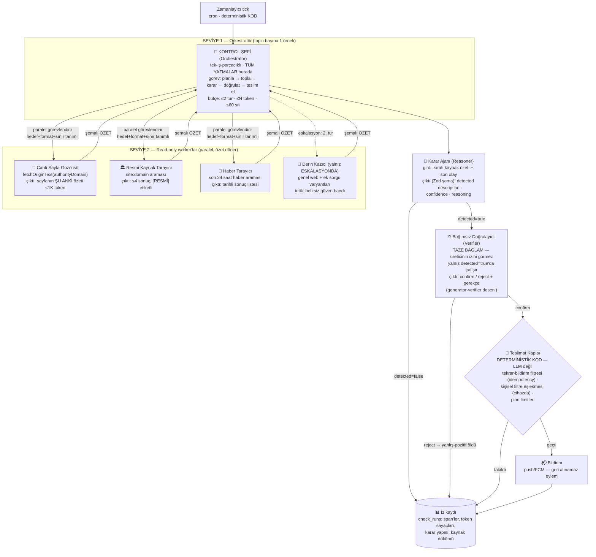
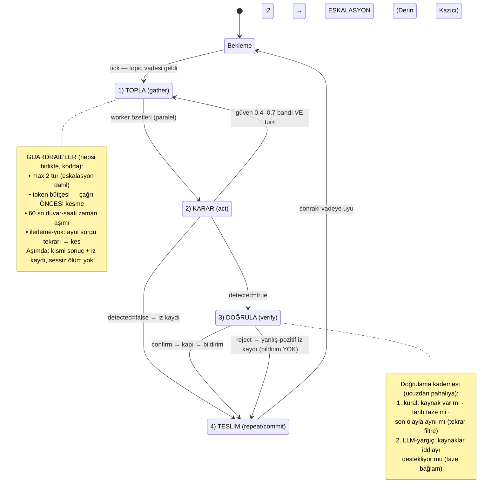

# Whenly Ajan Mimarisi — Plan, Ajan Ağacı ve Kontrol Döngüsü (ADR-060)

> Derin araştırma temelli tasarım (5 paralel araştırma kolu, birincil kaynak doğrulamalı).
> Tarih: 2026-06-11 · Durum: Kabul edilen hedef mimari; uygulama fazlıdır.

## 0. Araştırmanın yönetici özeti (kaynaklı)

**2025–2026 konsensüsü** (Anthropic + Cognition + sektör):

1. **Varsayılan tek ajan; çok-ajan yalnız read-ağırlıklı, gerçekten paralel, yüksek değerli işlerde.**
   Çok-ajan sistemler sohbete göre ~×15 token harcar; tek-ajan Opus'a karşı lead+worker %90.2 daha iyi sonuç ama yalnız breadth-first araştırmada ekonomik. Kodlama gibi paylaşılan-bağlam işlerine uygun değil. ([Anthropic — multi-agent research system](https://www.anthropic.com/engineering/multi-agent-research-system))
2. **"Mümkün olan en basit çözüm"** — gerekmiyorsa ajan bile kurma; tek LLM çağrısı + retrieval çoğu işte yeter. ([Anthropic — Building effective agents](https://www.anthropic.com/engineering/building-effective-agents))
3. **Claude Code döngüsü:** `bağlam topla → eylem al → işi doğrula → tekrarla`; doğrulama kademesi **kural-tabanlı → görsel → LLM-yargıç** (yargıç pahalı, en son). Subagent = **bağlam izolasyonu aracı**: on binlerce token harcar, ebeveyne **1–2K token özet** döner. ([Claude Agent SDK](https://claude.com/blog/building-agents-with-the-claude-agent-sdk), [context engineering](https://www.anthropic.com/engineering/effective-context-engineering-for-ai-agents))
4. **Hiyerarşi derinliği: 2 seviye** (lead → worker). Claude Code'da subagent subagent doğuramaz. ([Claude Code — subagents](https://code.claude.com/docs/en/sub-agents))
5. **Cognition uzlaşısı (read vs write):** paralel ajanlar **yazmada** çelişen örtük kararlar üretir → yazmalar tek-iş-parçacıklı kalmalı; read-only worker'lar ve **generator-verifier** (taze bağlamlı bağımsız denetçi) güvenli ve etkili. ([Don't Build Multi-Agents](https://cognition.ai/blog/dont-build-multi-agents), [What's Actually Working](https://cognition.ai/blog/multi-agents-working))
6. **Effort scaling:** basit iş → 1 ajan/3–10 araç çağrısı; karşılaştırma → 2–4 worker; karmaşık → 10+. Görev tanımı = hedef + çıktı formatı + araç rehberi + **net sınırlar**. (Anthropic multi-agent)
7. **Döngü kontrolü — 4 zorunlu guardrail birlikte:** max tur + token/maliyet bütçesi (çağrı ÖNCESİ kesme) + zaman aşımı + ilerleme-yok tespiti. Gerçek olay: bütçesiz 4 ajan, 11 günde 47.000 $ yaktı. ([kaynaklar raporda](https://cheatsheetseries.owasp.org/cheatsheets/AI_Agent_Security_Cheat_Sheet.html))
8. **İnsan/sistem onay kapısı:** geri alınamaz eylem (bizde: kullanıcıya bildirim atmak) deterministik kapıdan geçer; yetkilendirme LLM'e bırakılmaz. (OWASP AI Agent Cheat Sheet)
9. **Gözlemlenebilirlik:** her adım span olarak izlenir (OTel GenAI konvansiyonu: `invoke_agent`/`execute_tool`, token sayaçları); konuşma değil **karar yapıları** izlenir.
10. **Evals:** ~20–50 örnekli golden set + LLM-yargıç (0–1 puan, somut rubrik) + insan denetimi; trajectory (doğru araçlar doğru sırada) ayrı metrik.
11. **Ajanlar arası iletişim = şema-doğrulamalı yapılandırılmış çıktı** (Zod) — serbest metin anti-pattern. (MCP 2025 spesifikasyonu da zorunlu kıldı)
12. **Anti-pattern'ler:** gereksiz çok-ajan · aşırı framework soyutlaması · belirsiz görev tanımı · paylaşılan-yazma çakışması · görünmez durum · yapılandırılmamış mesajlaşma.

## 1. Whenly'ye uyarlama — neden bu tasarım

Whenly'nin tespit işi **read-ağırlıklı ve paralelleştirilebilir** (canlı sayfa + resmî arama + haber taraması) → worker deseni **uygun**.
Ama hacim yüksek/iş başına değer düşük (dakikada onlarca kontrol) → **×15 token anti-pattern'inden kaçınmak şart**.
Çözüm: **kademeli çaba (effort scaling)** — ucuz tek-geçiş varsayılan; yalnız *belirsiz* veya *tespit-pozitif* durumlarda derinleşme. Yazma (DB'ye olay kaydı + bildirim) **her zaman tek-iş-parçacıklı** Orkestratör'de kalır (Cognition ilkesi).

Mevcut kod zaten iyi bir çekirdek: `runSchedulerTick → kuyruk → LiveChecker(canlı∥resmî∥haber) → Reasoner → teslimat`. Bu, "Seviye-0 tek geçiş"tir. Eksikler: doğrulayıcı yok (yanlış-pozitif doğrudan bildirime gider), guardrail'ler örtük, eval/golden set yok, izleme kısmî (check_runs var ama token/karar span'i yok).

## 2. AJAN AĞACI (hedef mimari — 2 seviye, sabit)



**Görev tanımı sözleşmesi** (her worker için, Anthropic dörtlüsü):
`{ hedef, çıktı şeması (Zod), kullanılacak araç, sınır ("yalnız X domain'i; ≤N sonuç; spekülasyon yok") }`

**Model dağılımı (routing):** Worker'lar + Karar = hızlı/ucuz model (mevcut: Groq/DeepSeek sınıfı). Doğrulayıcı = **farklı örnek/daha güçlü model tercih** (aynı modelin kendine onay vermesi zayıf sinyal). Sihirbaz asistanı (ürünün ikinci ajanı) mevcut haliyle tek-ajan kalır — paylaşılan-bağlam işi, çok-ajan anti-pattern olur.

## 3. KONTROL DÖNGÜSÜ GÖSTERGESİ



**Döngünün üç zaman ölçeği:**

| Ölçek | Döngü | Sıklık |
|---|---|---|
| Mikro | topic başına gather→act→verify→commit | her kontrol (dk–saat) |
| Mezo | eskalasyon turu (belirsizlikte 2. tarama) | yalnız %~10 belirsiz vaka |
| Makro | eval döngüsü: golden set + LLM-yargıç + kullanıcı 👍/👎 geri bildirimi → prompt/sıralama iyileştirme | haftalık |

**Makro eval döngüsü** (mevcut 👍/👎 verisi zaten toplanıyor — `feedback` tablosu):
```
golden set (20–50 gerçek topic + beklenen sonuç)
   → her deploy öncesi koş (offline)
   → canlıda: yargıç-model örneklem puanlar (0–1, rubrik: kaynak kalitesi ·
     iddia-kanıt uyumu · tekrar-bildirim) + kullanıcı oyları
   → düşük puanlı trace insan kuyruğuna → golden set'e eklenir
```

## 4. UYGULAMA PLANI (fazlı — her faz tek başına değer üretir)

| Faz | İş | Standart dayanağı | Dokunulan kod |
|---|---|---|---|
| **A0** | **Guardrail'leri açık koda dök:** run-topic-check'e max-tur/token-bütçe/timeout/no-progress; aşımda kısmi sonuç + iz | 4'lü guardrail konsensüsü | `application/run-topic-check`, `live.checker` |
| **A1** | **Doğrulayıcı ajan (yanlış-pozitif katili):** detected=true → taze bağlamlı verifier (kural kademesi + yargıç); reject→bildirim yok, iz "rejected" | generator-verifier (Cognition) + verify-work (Anthropic) | yeni `infrastructure/checker/verifier.ts`, delivery öncesi |
| **A2** | **Eskalasyon turu:** güven 0.4–0.7 → Derin Kazıcı (ek sorgu varyantları) ile 2. tur; tur sayısı iz kaydına | effort scaling | `live.checker` |
| **A3** | **İz/span zenginleştirme:** check_runs'a token sayaçları + adım span'leri (OTel GenAI adlandırması: invoke_agent/execute_tool) | OTel GenAI | `check_runs` şema + logging |
| **A4** | **Eval düzeneği:** `pnpm eval` — golden set (20 topic) + yargıç prompt'u; CI'da rapor (bloklamaz, trend) | Anthropic eval dersleri | yeni `apps/backend/eval/` |
| **A5** | **Model routing:** worker/karar=ucuz, verifier=güçlü; sağlayıcı-bağımsız port (mevcut hexagonal mimariye uyar) | RouteLLM/Anthropic karması | `infrastructure/` config |

**Bilinçli YAPILMAYACAKLAR (anti-pattern listesi):**
- ❌ 3+ seviye hiyerarşi, "ajan ağı" — 2 seviye sabit
- ❌ Sihirbaz asistanını çok-ajanlaştırmak — paylaşılan-bağlam işi
- ❌ Worker'lara yazma yetkisi — tüm DB/bildirim yazmaları Orkestratör'de
- ❌ Ajan çerçevesi (framework) eklemek — doğrudan API + kendi ince döngümüz (Anthropic uyarısı)
- ❌ Serbest-metin ajan iletişimi — her sınır Zod şemalı (zaten `@watcher/contracts` geleneği)

## 5. Kaynakça (birincil)
- [Building effective agents — Anthropic](https://www.anthropic.com/engineering/building-effective-agents)
- [How we built our multi-agent research system — Anthropic](https://www.anthropic.com/engineering/multi-agent-research-system)
- [Building agents with the Claude Agent SDK](https://claude.com/blog/building-agents-with-the-claude-agent-sdk)
- [Effective context engineering for AI agents — Anthropic](https://www.anthropic.com/engineering/effective-context-engineering-for-ai-agents)
- [Writing effective tools for agents — Anthropic](https://www.anthropic.com/engineering/writing-tools-for-agents)
- [How Claude Code works · subagents · hooks — resmi dokümanlar](https://code.claude.com/docs/en/how-claude-code-works)
- [Don't Build Multi-Agents — Cognition](https://cognition.ai/blog/dont-build-multi-agents) · [Multi-Agents: What's Actually Working — Cognition](https://cognition.ai/blog/multi-agents-working)
- [ReAct (Yao 2022)](https://arxiv.org/abs/2210.03629) · [Reflexion (Shinn 2023)](https://arxiv.org/abs/2303.11366)
- [OTel GenAI semantic conventions](https://opentelemetry.io/docs/specs/semconv/gen-ai/) · [OWASP AI Agent Security Cheat Sheet](https://cheatsheetseries.owasp.org/cheatsheets/AI_Agent_Security_Cheat_Sheet.html)
- [LangChain — context engineering](https://www.langchain.com/blog/context-engineering-for-agents) · [Choosing the right multi-agent architecture](https://www.langchain.com/blog/choosing-the-right-multi-agent-architecture)
